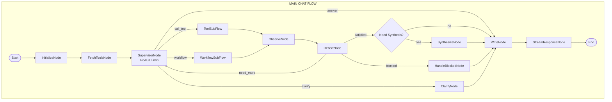
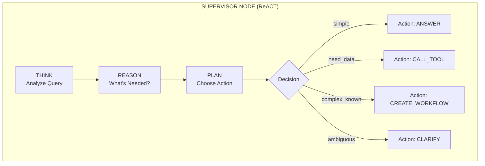
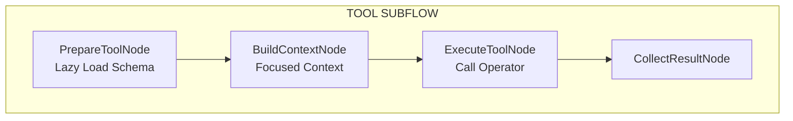
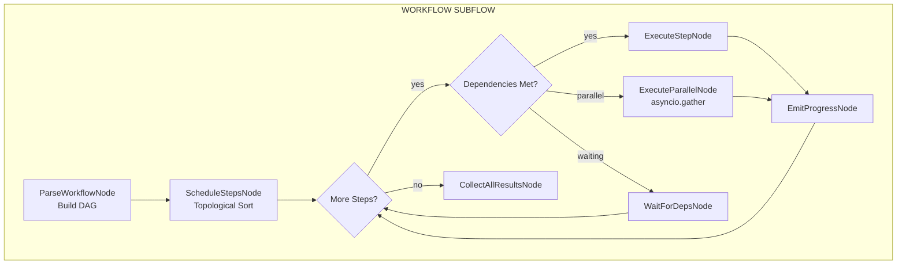
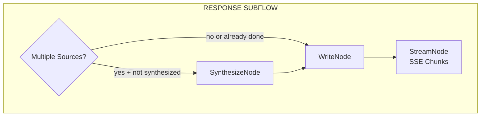

# Design Doc: Agentic Chatbot Backend

> **Note for AI**: This is a high-level design document. Follow Langchain/Langgraph patterns strictly.
> All flows are implemented as graphs with nodes and sub-graphs (nested flows).

---

## 1. Requirements

### User Stories

1. **As a user**, I want to ask complex questions and have the system break them down into steps automatically.
2. **As a user**, I want to see real-time progress as the system works on my request (never wonder "is it stuck?").
3. **As a user**, I want the system to use the right tools (RAG, web search, code) based on my question.
4. **As a user**, I want the system to recover gracefully when something goes wrong.
5. **As a user**, I want the system to ask me for clarification when my request is ambiguous.
6. **As a developer**, I want to easily add new operators without modifying core code.
7. **As a developer**, I want efficient token usage through lazy loading and focused context.

### Non-Functional Requirements

- **Extensibility**: Easy to add new operators via Registry pattern
- **Efficiency**: Lazy loading of MCP tools, focused context per operator
- **Observability**: Event-driven architecture with SSE streaming
- **Reliability**: 4-layer error handling (tool, operator, supervisor, LLM output validation)
- **Standards**: Full MCP protocol support for external tool communication
- **Async-First**: FastAPI with single event loop per request

---

## 2. Architecture Overview

### Core Concept: Supervisor as ReACT Agent

The **Supervisor** is the brain of the system - a ReACT (Reason + Act) agent that:
- **Thinks**: Analyzes the user query
- **Reasons**: Determines what information/actions are needed  
- **Plans**: Decides action type (direct answer, single tool, workflow, clarify)
- **Acts**: Executes the chosen action
- **Observes**: Reviews results from tools/workflow
- **Reflects**: Evaluates quality and decides next step

The Supervisor **always stays in control** and decides when to respond to the user.

### Four Supervisor Actions

```
┌─────────────────────────────────────────────────────────────────────────────┐
│                      SUPERVISOR ACTION TYPES                                 │
├─────────────────────────────────────────────────────────────────────────────┤
│                                                                              │
│  1. ANSWER         Simple question, no tools needed                         │
│     Example: "What is Python?" → Direct LLM response                        │
│                                                                              │
│  2. CALL_TOOL      Need data, exploring iteratively                         │
│     Example: "Search for AI news" → Call tool → Observe → Maybe more       │
│                                                                              │
│  3. CREATE_WORKFLOW Complex task with known steps upfront                   │
│     Example: "Compare our pricing to competitors" → Multi-step plan        │
│                                                                              │
│  4. CLARIFY        Ambiguous request, need user input                       │
│     Example: "Update the document" → Ask which document                    │
│                                                                              │
└─────────────────────────────────────────────────────────────────────────────┘
```

### Operators vs MCP Tools

```
┌─────────────────────────────────────────────────────────────────────────────┐
│  OPERATORS (Internal - This Repo)     │  MCP TOOLS (External Servers)       │
├───────────────────────────────────────┼─────────────────────────────────────┤
│  Python classes that orchestrate work │  External services via MCP protocol │
│                                       │                                     │
│  • QueryRewriter (uses LLM)           │  • rag_search (RAG server)          │
│  • Synthesizer (uses LLM)             │  • web_search (Search server)       │
│  • Writer (uses LLM)                  │  • code_executor (Sandbox server)   │
│  • RAGRetriever (calls MCP tool)      │  • ... (any MCP-compatible server)  │
│  • WebSearcher (calls MCP tool)       │                                     │
│  • Coder (uses LLM + MCP tool)        │                                     │
│                                       │                                     │
│  Registered in OperatorRegistry       │  Discovered via MCP client          │
│  (Factory + Registry Pattern)         │  (Lazy loaded via MCPServerRegistry)│
└───────────────────────────────────────┴─────────────────────────────────────┘
```

---

## 3. Design Patterns

### Pattern Catalog

| Pattern | Location | Purpose |
|---------|----------|---------|
| **Strategy** | `operators/base.py` | Operators as interchangeable algorithms |
| **Factory** | `operators/registry.py` | Dynamic operator instantiation |
| **Registry** | `operators/registry.py`, `mcp/registry.py` | Component registration and discovery |
| **Observer** | `events/emitter.py` | Event-driven SSE streaming |
| **Builder** | `context/assembler.py`, `core/workflow.py` | Complex object construction |
| **Chain of Responsibility** | Error handling layers | Graceful error escalation |
| **Mediator** | `core/supervisor.py` | Supervisor coordinates all components |
| **Template Method** | `nodes/base.py`, `operators/base.py` | Common behavior with extension points |
| **Command** | `core/supervisor.py` | Supervisor actions as command objects |
| **Composite** | `flows/` | Flows contain sub-flows and nodes |
| **State** | `core/supervisor.py` | ReACT loop state transitions |
| **Proxy** | `mcp/client.py` | Lazy loading proxy for MCP tools |
| **Retry with Feedback** | `utils/structured_llm.py` | LLM output validation with error-context retry |
| **Adapter** | `mcp/models.py` | Multi-modal content type normalization |

### Pattern Implementation Details

#### Strategy Pattern (Operators)

Operators come in three types based on their dependencies:

```
┌─────────────────────────────────────────────────────────────────────────────┐
│                           OPERATOR TYPES                                     │
├─────────────────────────────────────────────────────────────────────────────┤
│                                                                              │
│  TYPE 1: PURE LLM OPERATORS (No MCP - Fast Path)                            │
│  ───────────────────────────────────────────────                            │
│  Only call LLM. Supervisor can invoke directly without MCP overhead.        │
│                                                                              │
│  ┌───────────────┐ ┌───────────────┐ ┌───────────────┐ ┌───────────────┐   │
│  │ QueryRewriter │ │  Synthesizer  │ │    Writer     │ │   Analyzer    │   │
│  │ ───────────── │ │ ───────────── │ │ ───────────── │ │ ───────────── │   │
│  │ Model: Haiku  │ │ Model: Sonnet │ │ Model: Sonnet │ │ Model: Sonnet │   │
│  │ MCP: None     │ │ MCP: None     │ │ MCP: None     │ │ MCP: None     │   │
│  └───────────────┘ └───────────────┘ └───────────────┘ └───────────────┘   │
│                                                                              │
│  TYPE 2: MCP-BACKED OPERATORS (Need MCP Session)                            │
│  ───────────────────────────────────────────────                            │
│  Wrap MCP tools. Handle session lifecycle internally.                       │
│                                                                              │
│  ┌───────────────┐ ┌───────────────┐ ┌───────────────┐                     │
│  │ RAGRetriever  │ │  WebSearcher  │ │  FileManager  │                     │
│  │ ───────────── │ │ ───────────── │ │ ───────────── │                     │
│  │ Model: None   │ │ Model: None   │ │ Model: None   │                     │
│  │ MCP: rag_*    │ │ MCP: web_*    │ │ MCP: file_*   │                     │
│  └───────────────┘ └───────────────┘ └───────────────┘                     │
│                                                                              │
│  TYPE 3: HYBRID OPERATORS (LLM + MCP)                                       │
│  ────────────────────────────────────                                       │
│  Use LLM for reasoning AND MCP tools for execution.                         │
│                                                                              │
│  ┌───────────────┐ ┌───────────────┐                                       │
│  │    Coder      │ │  DataAnalyst  │  ← LLM reasons, MCP executes          │
│  │ ───────────── │ │ ───────────── │                                       │
│  │ Model: Sonnet │ │ Model: Sonnet │                                       │
│  │ MCP: run_*    │ │ MCP: query_*  │                                       │
│  └───────────────┘ └───────────────┘                                       │
│                                                                              │
└─────────────────────────────────────────────────────────────────────────────┘
```

```python
from abc import ABC, abstractmethod
from enum import Enum
from typing import TYPE_CHECKING

if TYPE_CHECKING:
    from agentic_chatbot.mcp.session import MCPSession


class OperatorType(Enum):
    """Type of operator based on dependencies."""
    PURE_LLM = "pure_llm"      # Only needs LLM
    MCP_BACKED = "mcp_backed"  # Only needs MCP tools
    HYBRID = "hybrid"          # Needs both LLM and MCP


class BaseOperator(ABC):
    """
    Base class for all operators.
    
    Design Pattern: Strategy Pattern
    
    Operators are interchangeable algorithms that the Supervisor
    can invoke. Each operator declares its type and requirements.
    """
    
    # Metadata
    name: str
    description: str
    operator_type: OperatorType
    
    # LLM config (for PURE_LLM and HYBRID)
    model: str | None = None  # "haiku" | "sonnet" | None
    
    # MCP config (for MCP_BACKED and HYBRID)
    mcp_tools: list[str] = []  # Which MCP tools this operator may use
    
    # Context requirements (for ContextAssembler)
    context_requirements: list[str] = []
    
    # Error handling
    fallback_operator: str | None = None  # Operator to use if this fails
    max_retries: int = 2
    
    @property
    def requires_mcp(self) -> bool:
        """Check if operator needs MCP session."""
        return self.operator_type in (OperatorType.MCP_BACKED, OperatorType.HYBRID)
    
    @property
    def requires_llm(self) -> bool:
        """Check if operator needs LLM."""
        return self.operator_type in (OperatorType.PURE_LLM, OperatorType.HYBRID)
    
    @abstractmethod
    async def execute(
        self,
        context: "OperatorContext",
        mcp_session: "MCPSession | None" = None,
    ) -> "OperatorResult":
        """
        Execute the operator.
        
        Args:
            context: Focused context built by ContextAssembler
            mcp_session: MCP session (required if requires_mcp=True)
            
        Returns:
            OperatorResult with output and metadata
        """
        pass


# Example: Pure LLM Operator
@OperatorRegistry.register("query_rewriter")
class QueryRewriterOperator(BaseOperator):
    """Rewrites queries for better search results."""
    
    name = "query_rewriter"
    description = "Rewrites and expands queries for better search"
    operator_type = OperatorType.PURE_LLM
    model = "haiku"
    context_requirements = ["query"]
    
    async def execute(
        self,
        context: "OperatorContext",
        mcp_session: "MCPSession | None" = None,
    ) -> "OperatorResult":
        # No MCP needed - direct LLM call
        prompt = f"Rewrite this query for search: {context.query}"
        result = await call_llm(prompt, model=self.model)
        return OperatorResult(output=result)


# Example: MCP-Backed Operator
@OperatorRegistry.register("rag_retriever")
class RAGRetrieverOperator(BaseOperator):
    """Searches internal documents via RAG."""
    
    name = "rag_retriever"
    description = "Search internal knowledge base"
    operator_type = OperatorType.MCP_BACKED
    mcp_tools = ["rag_search", "rag_get_document"]
    context_requirements = ["query", "tools.schema(rag_search)"]
    
    async def execute(
        self,
        context: "OperatorContext",
        mcp_session: "MCPSession | None" = None,
    ) -> "OperatorResult":
        if not mcp_session:
            raise OperatorError("MCP session required")
        
        result = await mcp_session.call_tool(
            "rag_search", 
            {"query": context.query, "top_k": 5}
        )
        return OperatorResult(output=result)


# Example: Hybrid Operator
@OperatorRegistry.register("coder")
class CoderOperator(BaseOperator):
    """Writes and executes code."""
    
    name = "coder"
    description = "Write and run code"
    operator_type = OperatorType.HYBRID
    model = "sonnet"
    mcp_tools = ["run_python", "run_javascript"]
    context_requirements = ["query", "language", "tools.schema(run_python)"]
    
    async def execute(
        self,
        context: "OperatorContext",
        mcp_session: "MCPSession | None" = None,
    ) -> "OperatorResult":
        if not mcp_session:
            raise OperatorError("MCP session required")
        
        # Step 1: LLM generates code
        code = await call_llm(
            f"Write {context.language} code to: {context.query}",
            model=self.model,
        )
        
        # Step 2: MCP executes code
        result = await mcp_session.call_tool(
            f"run_{context.language}",
            {"code": code},
        )
        
        return OperatorResult(output={"code": code, "result": result})
```

#### Factory + Registry Pattern
```python
class OperatorRegistry:
    """Registry with factory method for operator creation."""
    
    _operators: dict[str, type[BaseOperator]] = {}
    
    @classmethod
    def register(cls, name: str):
        """Decorator to register operators."""
        def decorator(operator_class):
            cls._operators[name] = operator_class
            return operator_class
        return decorator
    
    @classmethod
    def create(cls, name: str, **kwargs) -> BaseOperator:
        """Factory method to create operator instances."""
        return cls._operators[name](**kwargs)
```

#### Observer Pattern (Events)
```python
class EventEmitter:
    """Publish-subscribe for real-time events."""
    
    def subscribe(self, pattern: str, handler: EventHandler) -> str: ...
    def emit(self, event: Event) -> None: ...
    async def emit_async(self, event: Event) -> None: ...
```

#### Composite Pattern (Flows)
```python
# Flows are graphs that contain nodes or other flows (sub-graphs)
main_flow = Flow(start=supervisor_node)
workflow_subflow = Flow(start=execute_steps_node)

# Composition
supervisor_node - "workflow" >> workflow_subflow
workflow_subflow >> reflect_node
```

---

## 4. Flow Design (Graph Structure)

### Main Chat Flow (Top-Level Graph)



### Supervisor Node (ReACT State Machine)



### Tool SubFlow (Sub-Graph)



### Workflow SubFlow (Sub-Graph)



### Response SubFlow (Sub-Graph)



---

## 5. Node Design

### Node Categories

```
┌─────────────────────────────────────────────────────────────────────────────┐
│                           NODE CATEGORIES                                    │
├─────────────────────────────────────────────────────────────────────────────┤
│                                                                              │
│  ORCHESTRATION NODES (Control Flow)                                         │
│  ├── SupervisorNode      - ReACT loop, decision making                      │
│  ├── ObserveNode         - Collect and compress results for supervisor      │
│  ├── ReflectNode         - Quality evaluation, next action decision         │
│  └── HandleBlockedNode   - Graceful degradation when stuck                  │
│                                                                              │
│  EXECUTION NODES (Do Work)                                                  │
│  ├── ExecuteToolNode     - Run single operator                              │
│  ├── ExecuteStepNode     - Run workflow step                                │
│  ├── ExecuteParallelNode - Run multiple steps concurrently                  │
│  └── SynthesizeNode      - Combine multiple sources                         │
│                                                                              │
│  CONTEXT NODES (Prepare Data)                                               │
│  ├── InitializeNode      - Setup request context                            │
│  ├── FetchToolsNode      - Load MCP tool summaries                          │
│  ├── BuildContextNode    - Build focused context for operator               │
│  ├── PrepareToolNode     - Lazy load tool schema                            │
│  └── CollectResultNode   - Store operator output                            │
│                                                                              │
│  WORKFLOW NODES (Multi-Step)                                                │
│  ├── ParseWorkflowNode   - Parse workflow definition into DAG               │
│  ├── ScheduleStepsNode   - Determine execution order                        │
│  ├── WaitForDepsNode     - Wait for dependencies                            │
│  └── CollectAllResultsNode - Gather all step outputs                        │
│                                                                              │
│  OUTPUT NODES (Respond)                                                     │
│  ├── WriteNode           - Format response with Writer operator             │
│  ├── StreamNode          - SSE chunk streaming                              │
│  ├── ClarifyNode         - Generate clarification question                  │
│  └── EmitProgressNode    - Send progress event to user                      │
│                                                                              │
└─────────────────────────────────────────────────────────────────────────────┘
```

### Node Specifications

#### SupervisorNode (ReACT)

- **Purpose**: Central decision-making agent
- **Type**: Regular Node (with internal state machine)
- **Max Iterations**: 5
- **Context Requirements**: `conversation.recent(5)`, `conversation.summary`, `tools.summaries`, `actions.this_turn`
- **Steps**:
  - *prep*: Assemble supervisor context via ContextAssembler
  - *exec*: Call LLM with ReACT prompt, get structured decision
  - *post*: Store decision, emit `supervisor.decided` event, return action string
- **Returns**: `"answer"` | `"call_tool"` | `"workflow"` | `"clarify"`

#### ExecuteToolNode

- **Purpose**: Execute single operator with focused context
- **Type**: Regular Node (with retry via PocketFlow)
- **Context Requirements**: Dynamic based on operator
- **Steps**:
  - *prep*: Get operator from registry, build focused context
  - *exec*: Call `operator.execute(context)`
  - *post*: Store result, emit `operator.completed` event

#### ParseWorkflowNode

- **Purpose**: Convert workflow plan to executable DAG
- **Type**: Regular Node
- **Steps**:
  - *prep*: Read workflow definition from shared
  - *exec*: Build dependency graph, validate, topological sort
  - *post*: Store execution schedule

#### ExecuteParallelNode

- **Purpose**: Run independent workflow steps concurrently
- **Type**: AsyncNode (uses asyncio.gather)
- **Steps**:
  - *prep*: Get steps with no pending dependencies
  - *exec*: `await asyncio.gather(*[run_step(s) for s in parallel_steps])`
  - *post*: Store all results, emit progress events

#### ReflectNode

- **Purpose**: Evaluate results and decide next action
- **Type**: Regular Node
- **Steps**:
  - *prep*: Get collected results, original query
  - *exec*: Call LLM to evaluate relevance, completeness, quality
  - *post*: Store reflection, return `"satisfied"` | `"need_more"` | `"blocked"`

#### SynthesizeNode

- **Purpose**: Combine multiple sources into coherent content
- **Type**: Regular Node
- **Uses**: Synthesizer operator (Sonnet model)
- **Steps**:
  - *prep*: Get all source results
  - *exec*: Call synthesizer operator
  - *post*: Store synthesized content

#### WriteNode

- **Purpose**: Format final response for user
- **Type**: Regular Node
- **Uses**: Writer operator (Sonnet model)
- **Steps**:
  - *prep*: Get content to format, user context
  - *exec*: Call writer operator
  - *post*: Store formatted response

#### StreamNode

- **Purpose**: Stream response chunks via SSE
- **Type**: Regular Node
- **Steps**:
  - *prep*: Get formatted response
  - *exec*: Split into chunks
  - *post*: Emit `response.chunk` events, then `response.done`

---

## 6. Context Management

### Dynamic Context Assembler

The Context Assembler uses a **pull-based** approach where components declare what they need:

```python
class ContextAssembler:
    """
    Dynamically assembles context based on component requirements.
    
    Design Pattern: Builder Pattern
    """
    
    def __init__(
        self,
        memory: ConversationMemory,
        mcp_registry: MCPServerRegistry,
        result_store: ResultStore,
        action_history: ActionHistory,
    ):
        self._sources = {
            "conversation": memory,
            "tools": mcp_registry,      # MCPServerRegistry for tool info
            "results": result_store,
            "actions": action_history,
        }
    
    async def assemble(
        self,
        requirements: list[str],
        query: str,
    ) -> AssembledContext:
        """
        Assemble context based on requirements.
        
        Requirements DSL:
        - "conversation.recent(5)"     → Last 5 messages
        - "conversation.summary"       → Summary of older messages
        - "tools.summaries"            → All tool short descriptions
        - "tools.schema(web_search)"   → Full schema (lazy loaded)
        - "results.step(2)"            → Output from workflow step 2
        - "results.all"                → All results this turn
        - "actions.this_turn"          → Actions taken this turn
        """
        context = AssembledContext(query=query)
        
        for req in requirements:
            source, method = self._parse_requirement(req)
            data = await self._sources[source].get(method)
            context.add(req, data)
        
        return context
```

### Conversation Memory

```python
class ConversationMemory:
    """
    Manages conversation history with window + summary.
    
    Window: Last 5 messages (configurable)
    Summary: Compressed summary of older messages
    """
    
    def __init__(self, window_size: int = 5):
        self.window_size = window_size
        self._messages: list[Message] = []
        self._summary: str = ""
    
    async def get(self, method: str) -> Any:
        if method == "recent(5)":
            return self._messages[-5:]
        elif method == "summary":
            return self._summary
        elif method == "all":
            return {"summary": self._summary, "recent": self._messages[-5:]}
```

### Focused Context for Operators

Each operator declares its context requirements:

```python
@OperatorRegistry.register("rag_retriever")
class RAGRetrieverOperator(BaseOperator):
    """RAG retrieval operator."""
    
    name = "rag_retriever"
    description = "Search internal documents"
    operator_type = OperatorType.MCP_BACKED
    
    # What this operator needs
    context_requirements = [
        "query",                           # The search query
        "tools.schema(rag_search)",        # Full MCP tool schema
    ]
    
    # MCP-backed operators don't use LLM
    mcp_tools = ["rag_search", "rag_get_document"]
```

---

## 7. Workflow System

### Workflow Definition Schema

```python
@dataclass
class WorkflowDefinition:
    """
    Workflow created by Supervisor for complex tasks.
    
    Design Pattern: Builder Pattern (created by Supervisor)
    """
    goal: str
    steps: list[WorkflowStep]

@dataclass  
class WorkflowStep:
    id: str
    name: str
    operator: str
    input_mapping: dict[str, str]  # Template variables like "{{step_1.output}}"
    depends_on: list[str]          # Step IDs this depends on
```

### Workflow Executor

```python
class WorkflowExecutor:
    """
    Executes workflow steps respecting dependencies.
    
    Features:
    - Parallel execution of independent steps
    - Dependency resolution via topological sort
    - Progress events per step
    - Focused context per step
    
    Design Pattern: Chain of Responsibility (step execution)
    """
    
    async def execute(
        self,
        workflow: WorkflowDefinition,
        context_assembler: ContextAssembler,
        event_emitter: EventEmitter,
    ) -> WorkflowResult:
        
        # Build dependency DAG
        dag = self._build_dag(workflow.steps)
        
        # Execute in topological order with parallel optimization
        results = {}
        for batch in self._get_execution_batches(dag):
            if len(batch) == 1:
                # Sequential execution
                results[batch[0].id] = await self._execute_step(batch[0])
            else:
                # Parallel execution
                batch_results = await asyncio.gather(
                    *[self._execute_step(step) for step in batch]
                )
                for step, result in zip(batch, batch_results):
                    results[step.id] = result
        
        return WorkflowResult(steps=results)
```

### Example Workflow

```yaml
goal: "Compare our pricing to competitors"
steps:
  - id: "step_1"
    name: "Rewrite Query"
    operator: "query_rewriter"
    input_mapping:
      query: "{{user_query}}"
    depends_on: []
    
  - id: "step_2"
    name: "Search Internal Docs"
    operator: "rag_retriever"
    input_mapping:
      query: "{{step_1.internal_query}}"
    depends_on: ["step_1"]
    
  - id: "step_3"
    name: "Search Web"
    operator: "web_searcher"
    input_mapping:
      query: "{{step_1.external_query}}"
    depends_on: ["step_1"]  # Can run PARALLEL with step_2
    
  - id: "step_4"
    name: "Synthesize"
    operator: "synthesizer"
    input_mapping:
      sources:
        - "{{step_2.results}}"
        - "{{step_3.results}}"
    depends_on: ["step_2", "step_3"]  # Waits for both
```

---

## 8. Event System (SSE Streaming)

### Event Types

```python
class EventType(str, Enum):
    # Supervisor events
    SUPERVISOR_THINKING = "supervisor.thinking"
    SUPERVISOR_DECIDED = "supervisor.decided"
    
    # Tool/Operator events
    TOOL_START = "tool.start"
    TOOL_PROGRESS = "tool.progress"
    TOOL_CONTENT = "tool.content"      # Multi-modal content (images, widgets)
    TOOL_COMPLETE = "tool.complete"
    TOOL_ERROR = "tool.error"
    
    # MCP events (internal, mapped to tool events)
    MCP_PROGRESS = "mcp.progress"
    MCP_CONTENT = "mcp.content"
    MCP_ELICITATION = "mcp.elicitation"
    MCP_ERROR = "mcp.error"
```

> **Note**: MCP events are internal events from MCP callbacks. They are mapped to user-facing
> `tool.*` events before being sent to the SSE stream. This separation allows internal
> logging/debugging while presenting a cleaner API to clients.

```python
    # Workflow events
    WORKFLOW_CREATED = "workflow.created"
    WORKFLOW_STEP_START = "workflow.step.start"
    WORKFLOW_STEP_COMPLETE = "workflow.step.complete"
    WORKFLOW_COMPLETE = "workflow.complete"
    
    # Response events
    RESPONSE_CHUNK = "response.chunk"
    RESPONSE_DONE = "response.done"
    
    # User interaction events
    CLARIFY_REQUEST = "clarify.request"
    ERROR = "error"
```

### SSE Stream Format

```
data: {"type": "supervisor.thinking", "message": "Analyzing your question..."}

data: {"type": "supervisor.decided", "action": "workflow", "message": "Creating a plan..."}

data: {"type": "workflow.created", "steps": 4}

data: {"type": "workflow.step.start", "step": 1, "name": "Rewrite Query"}

data: {"type": "workflow.step.complete", "step": 1}

data: {"type": "workflow.step.start", "step": 2, "name": "Search Internal Docs"}

data: {"type": "workflow.step.start", "step": 3, "name": "Search Web"}

data: {"type": "workflow.step.complete", "step": 2}

data: {"type": "workflow.step.complete", "step": 3}

data: {"type": "workflow.step.start", "step": 4, "name": "Synthesize"}

data: {"type": "workflow.step.complete", "step": 4}

data: {"type": "response.chunk", "content": "Based on my research, "}

data: {"type": "response.chunk", "content": "here's the comparison:\n\n"}

data: {"type": "response.done"}
```

### Multi-Modal SSE Stream Example

When a tool returns images, charts, or widgets:

```
data: {"type": "tool.start", "tool": "data_analyzer", "message": "Analyzing dataset..."}

data: {"type": "tool.progress", "tool": "data_analyzer", "progress": 0.5, "message": "Processing..."}

data: {"type": "tool.content", "tool": "data_analyzer", "content_type": "text/markdown", "data": "## Analysis Results\n..."}

data: {"type": "tool.content", "tool": "data_analyzer", "content_type": "image/png", "encoding": "base64", "data": "iVBORw0KGgo...", "metadata": {"alt_text": "Revenue chart"}}

data: {"type": "tool.content", "tool": "data_analyzer", "content_type": "application/vnd.mcp.widget+json", "data": {"widget_type": "data_table", "columns": [...], "rows": [...]}}

data: {"type": "tool.complete", "tool": "data_analyzer", "content_count": 3}
```

---

## 9. Error Handling (4 Layers)

```
┌─────────────────────────────────────────────────────────────────────────────┐
│                     ERROR HANDLING ARCHITECTURE                              │
├─────────────────────────────────────────────────────────────────────────────┤
│                                                                              │
│  LAYER 4: LLM Structured Output Validation                                  │
│  ─────────────────────────────────────────                                  │
│  When: LLM returns invalid JSON or schema-invalid response                  │
│  Action: Retry with error feedback in prompt                                │
│  Retries: 3 (with increasing context about the error)                       │
│                                                                              │
│  LAYER 3: Supervisor Level (Strategic)                                      │
│  ─────────────────────────────────────                                      │
│  When: Operator fails or results are incomplete                             │
│  Action: Supervisor decides: retry differently, use partial, or inform user │
│  Retries: Part of ReACT loop (up to max_iterations)                         │
│                                                                              │
│  LAYER 2: Operator Level (Smart Fallback)                                   │
│  ────────────────────────────────────────                                   │
│  When: Operator execution fails                                             │
│  Action: Use configured fallback operator                                   │
│  Retries: 1 (fallback only)                                                 │
│                                                                              │
│  LAYER 1: Tool Level (Automatic Retry)                                      │
│  ─────────────────────────────────────                                      │
│  When: Transient network/server errors                                      │
│  Action: Exponential backoff retry                                          │
│  Retries: 3 (automatic, transparent)                                        │
│                                                                              │
└─────────────────────────────────────────────────────────────────────────────┘
```

### Layer 1: Tool Level (Automatic Retry)

```python
class MCPClient:
    """MCP client with automatic retry."""
    
    @retry(
        stop=stop_after_attempt(3),
        wait=wait_exponential(multiplier=1, min=1, max=10),
        retry=retry_if_exception_type(TransientError),
    )
    async def call_tool(self, server_id: str, tool_name: str, params: dict):
        """Call MCP tool with automatic retry for transient errors."""
        ...
```

### Layer 2: Operator Level (Smart Fallback)

```python
class BaseOperator(ABC):
    """Base operator with fallback support."""
    
    fallback_operator: str | None = None
    
    async def execute_with_fallback(self, context: OperatorContext) -> OperatorResult:
        try:
            return await self.execute(context)
        except OperatorError as e:
            if self.fallback_operator:
                fallback = OperatorRegistry.create(self.fallback_operator)
                return await fallback.execute(context)
            raise
```

### Layer 3: Supervisor Level (Strategic)

```python
# In ReflectNode
def decide_on_failure(self, error: Exception, partial_results: dict) -> str:
    """Supervisor decides how to handle failures."""
    
    if self._can_retry_differently():
        return "need_more"  # Loop back with different approach
    
    if self._has_useful_partial_results(partial_results):
        return "satisfied"  # Proceed with what we have
    
    return "blocked"  # Inform user gracefully
```

### Layer 4: LLM Structured Output Validation (Error-Feedback Retry)

LLMs often need to return structured JSON (e.g., Supervisor decisions, workflow plans).
When the LLM generates malformed or schema-invalid output, we retry with error feedback.

```
┌─────────────────────────────────────────────────────────────────────────────┐
│                 LLM STRUCTURED OUTPUT VALIDATION FLOW                        │
├─────────────────────────────────────────────────────────────────────────────┤
│                                                                              │
│  ┌─────────────┐     ┌──────────────┐     ┌──────────────┐                  │
│  │ Build Prompt│────▶│ Call LLM     │────▶│ Parse JSON   │                  │
│  │ + Schema    │     │              │     │              │                  │
│  └─────────────┘     └──────────────┘     └──────┬───────┘                  │
│                                                   │                          │
│                                  ┌────────────────┴────────────────┐        │
│                                  │                                  │        │
│                                  ▼                                  ▼        │
│                           ┌─────────────┐                   ┌─────────────┐ │
│                           │ Valid JSON? │                   │ Parse Error │ │
│                           │    YES      │                   │             │ │
│                           └──────┬──────┘                   └──────┬──────┘ │
│                                  │                                  │        │
│                                  ▼                                  │        │
│                           ┌─────────────┐                          │        │
│                           │ Schema Valid?│                         │        │
│                           │    YES      │                          │        │
│                           └──────┬──────┘                          │        │
│                                  │                                  │        │
│                                  ▼                                  │        │
│                           ┌─────────────┐    ┌───────────────┐     │        │
│                           │   Return    │    │ Schema Error  │     │        │
│                           │   Result    │    └───────┬───────┘     │        │
│                           └─────────────┘            │              │        │
│                                                      │              │        │
│                                      ┌───────────────┴──────────────┘        │
│                                      │                                       │
│                                      ▼                                       │
│                           ┌──────────────────────────┐                      │
│                           │ Retry < MAX_RETRIES?     │                      │
│                           │                          │                      │
│                           │ YES: Add error to prompt │                      │
│                           │       → Loop back        │                      │
│                           │                          │                      │
│                           │ NO: Raise ValidationError│                      │
│                           └──────────────────────────┘                      │
│                                                                              │
└─────────────────────────────────────────────────────────────────────────────┘
```

#### StructuredLLMCaller Implementation

```python
from pydantic import BaseModel, ValidationError
from typing import TypeVar, Type
import json

T = TypeVar("T", bound=BaseModel)


class StructuredOutputError(Exception):
    """Raised when LLM output cannot be validated after retries."""
    
    def __init__(self, message: str, attempts: list[dict]):
        super().__init__(message)
        self.attempts = attempts  # History of failed attempts


class StructuredLLMCaller:
    """
    Calls LLM expecting structured JSON output with validation and retry.
    
    Features:
    - Pydantic schema validation
    - Error-feedback retry (tells LLM what went wrong)
    - Configurable max retries
    - Preserves original inputs on retry
    """
    
    def __init__(
        self,
        llm_client: "LLMClient",
        max_retries: int = 3,
    ):
        self.llm_client = llm_client
        self.max_retries = max_retries
    
    async def call(
        self,
        prompt: str,
        response_model: Type[T],
        system: str | None = None,
        model: str = "sonnet",
    ) -> T:
        """
        Call LLM and parse response into Pydantic model.
        
        Args:
            prompt: User prompt requesting structured output
            response_model: Pydantic model class for validation
            system: System prompt (will append schema instructions)
            model: LLM model to use
            
        Returns:
            Validated Pydantic model instance
            
        Raises:
            StructuredOutputError: After max_retries failures
        """
        # Build schema instruction
        schema_json = response_model.model_json_schema()
        schema_instruction = self._build_schema_instruction(schema_json)
        
        full_system = f"{system or ''}\n\n{schema_instruction}".strip()
        attempts: list[dict] = []
        current_prompt = prompt
        
        for attempt in range(self.max_retries):
            # Call LLM
            response = await self.llm_client.complete(
                prompt=current_prompt,
                system=full_system,
                model=model,
            )
            
            raw_output = response.content
            
            # Try to parse JSON
            try:
                # Extract JSON from response (handle markdown code blocks)
                json_str = self._extract_json(raw_output)
                data = json.loads(json_str)
            except json.JSONDecodeError as e:
                error_msg = f"Invalid JSON: {e.msg} at position {e.pos}"
                attempts.append({
                    "attempt": attempt + 1,
                    "raw_output": raw_output[:500],
                    "error_type": "json_parse",
                    "error": error_msg,
                })
                current_prompt = self._build_retry_prompt(
                    original_prompt=prompt,
                    error_type="JSON Parse Error",
                    error_details=error_msg,
                    raw_output=raw_output,
                )
                continue
            
            # Try to validate against Pydantic schema
            try:
                result = response_model.model_validate(data)
                return result
            except ValidationError as e:
                error_msg = self._format_validation_errors(e)
                attempts.append({
                    "attempt": attempt + 1,
                    "raw_output": raw_output[:500],
                    "parsed_json": data,
                    "error_type": "schema_validation",
                    "error": error_msg,
                })
                current_prompt = self._build_retry_prompt(
                    original_prompt=prompt,
                    error_type="Schema Validation Error",
                    error_details=error_msg,
                    raw_output=raw_output,
                )
                continue
        
        # All retries exhausted
        raise StructuredOutputError(
            f"Failed to get valid structured output after {self.max_retries} attempts",
            attempts=attempts,
        )
    
    def _build_schema_instruction(self, schema: dict) -> str:
        """Build instruction telling LLM the expected schema."""
        return f"""You MUST respond with valid JSON matching this schema:

```json
{json.dumps(schema, indent=2)}
```

Rules:
1. Output ONLY valid JSON, no explanations before or after
2. All required fields must be present
3. Field types must match the schema exactly
4. Use null for optional fields if not applicable"""
    
    def _build_retry_prompt(
        self,
        original_prompt: str,
        error_type: str,
        error_details: str,
        raw_output: str,
    ) -> str:
        """Build prompt for retry with error feedback."""
        return f"""{original_prompt}

---
PREVIOUS ATTEMPT FAILED - Please fix and try again.

Error Type: {error_type}
Error Details: {error_details}

Your previous output was:
```
{raw_output[:1000]}
```

Please provide a corrected JSON response that fixes these issues."""
    
    def _extract_json(self, text: str) -> str:
        """Extract JSON from response, handling markdown code blocks."""
        text = text.strip()
        
        # Try to extract from markdown code block
        if "```json" in text:
            start = text.find("```json") + 7
            end = text.find("```", start)
            if end > start:
                return text[start:end].strip()
        
        if "```" in text:
            start = text.find("```") + 3
            end = text.find("```", start)
            if end > start:
                return text[start:end].strip()
        
        # Try to find JSON object/array directly
        for start_char, end_char in [("{", "}"), ("[", "]")]:
            start = text.find(start_char)
            if start != -1:
                # Find matching closing bracket
                depth = 0
                for i, char in enumerate(text[start:], start):
                    if char == start_char:
                        depth += 1
                    elif char == end_char:
                        depth -= 1
                        if depth == 0:
                            return text[start:i+1]
        
        return text
    
    def _format_validation_errors(self, error: ValidationError) -> str:
        """Format Pydantic validation errors for LLM feedback."""
        errors = []
        for e in error.errors():
            loc = " -> ".join(str(x) for x in e["loc"])
            errors.append(f"- Field '{loc}': {e['msg']}")
        return "\n".join(errors)
```

#### Usage Example: Supervisor Decision

```python
# Define the expected schema
class SupervisorDecision(BaseModel):
    """Schema for Supervisor's action decision."""
    
    action: Literal["ANSWER", "CALL_TOOL", "CREATE_WORKFLOW", "CLARIFY"]
    reasoning: str
    
    # For ANSWER
    response: str | None = None
    
    # For CALL_TOOL
    operator: str | None = None
    params: dict[str, Any] | None = None
    
    # For CREATE_WORKFLOW
    goal: str | None = None
    steps: list[dict] | None = None
    
    # For CLARIFY
    question: str | None = None


# Use in SupervisorNode
class SupervisorNode(AsyncNode):
    async def execute(self, shared: dict) -> str:
        caller = StructuredLLMCaller(self.llm_client, max_retries=3)
        
        try:
            decision = await caller.call(
                prompt=self._build_decision_prompt(shared),
                response_model=SupervisorDecision,
                system=SUPERVISOR_SYSTEM_PROMPT,
                model="sonnet",
            )
            
            shared["supervisor"]["current_decision"] = decision
            return decision.action.lower()
            
        except StructuredOutputError as e:
            # Log all attempts for debugging
            logger.error(f"Supervisor decision failed: {e.attempts}")
            
            # Fallback to CLARIFY action
            shared["supervisor"]["current_decision"] = SupervisorDecision(
                action="CLARIFY",
                reasoning="Unable to determine appropriate action",
                question="Could you please rephrase your request?",
            )
            return "clarify"
```

#### Validation Error Feedback Example

```
# First attempt (invalid JSON)
LLM Output: "I'll help with that. Here's my decision: {action: CALL_TOOL..."
Error: Invalid JSON: Expecting property name enclosed in double quotes at position 45

# Retry prompt includes:
PREVIOUS ATTEMPT FAILED - Please fix and try again.
Error Type: JSON Parse Error
Error Details: Invalid JSON: Expecting property name enclosed in double quotes at position 45

# Second attempt (schema error)
LLM Output: {"action": "SEARCH", "reasoning": "..."}
Error: - Field 'action': Input should be 'ANSWER', 'CALL_TOOL', 'CREATE_WORKFLOW' or 'CLARIFY'

# Retry prompt includes:
Error Type: Schema Validation Error  
Error Details: - Field 'action': Input should be 'ANSWER', 'CALL_TOOL', 'CREATE_WORKFLOW' or 'CLARIFY'

# Third attempt (success)
LLM Output: {"action": "CALL_TOOL", "reasoning": "User wants to search", "operator": "web_searcher", ...}
```

---

## 10. MCP Integration

### MCP Architecture Overview

The system integrates with multiple external MCP servers, each hosting multiple tools.
We use the **official MCP Python SDK** as base and extend for our needs.

```
┌─────────────────────────────────────────────────────────────────────────────────┐
│                         MCP ARCHITECTURE                                         │
├─────────────────────────────────────────────────────────────────────────────────┤
│                                                                                  │
│  EXTERNAL (MCP Servers)              │  INTERNAL (This Chatbot)                 │
│  ──────────────────────────────────  │  ────────────────────────────────────── │
│                                      │                                          │
│  ┌────────────────────────────────┐  │  ┌────────────────────────────────────┐ │
│  │    MCP Discovery Service       │  │  │      MCPServerRegistry             │ │
│  │    (Lists all servers)         │◄─┼──│  • Caches server list (5 min TTL)  │ │
│  └────────────────────────────────┘  │  │  • Maps tool_name → server_id      │ │
│                                      │  │  • Tracks server health            │ │
│  ┌────────────────────────────────┐  │  └────────────────────────────────────┘ │
│  │    MCP Server: RAG             │  │                   │                     │
│  │    ├── rag_search              │  │                   ▼                     │
│  │    ├── rag_index               │  │  ┌────────────────────────────────────┐ │
│  │    └── rag_delete              │  │  │      MCPClientManager              │ │
│  └────────────────────────────────┘  │  │  • One httpx client per server     │ │
│                                      │  │  • Semaphore concurrency control   │ │
│  ┌────────────────────────────────┐  │  │  • Health tracking                 │ │
│  │    MCP Server: WebSearch       │  │  │  • Graceful shutdown               │ │
│  │    ├── web_search              │  │  └────────────────────────────────────┘ │
│  │    └── news_search             │  │                   │                     │
│  └────────────────────────────────┘  │                   ▼                     │
│                                      │  ┌────────────────────────────────────┐ │
│  ┌────────────────────────────────┐  │  │      MCPSessionManager             │ │
│  │    MCP Server: CodeExec        │  │  │  • Creates sessions per request    │ │
│  │    ├── run_python              │  │  │  • Streamable HTTP (SSE)           │ │
│  │    ├── run_javascript          │  │  │  • Callback routing                │ │
│  │    └── run_shell               │  │  │  • Auto-cleanup (context manager)  │ │
│  └────────────────────────────────┘  │  └────────────────────────────────────┘ │
│                                      │                   │                     │
│                                      │                   ▼                     │
│                                      │  ┌────────────────────────────────────┐ │
│                                      │  │      MCPSession                    │ │
│                                      │  │  • Bound to tool call(s)           │ │
│                                      │  │  • Progress callback → Events      │ │
│                                      │  │  • Elicitation callback → User     │ │
│                                      │  │  • Content callback → Stream       │ │
│                                      │  │  • Auto-cleanup on exit/error      │ │
│                                      │  └────────────────────────────────────┘ │
│                                      │                                          │
└─────────────────────────────────────────────────────────────────────────────────┘
```

### Lazy Loading Strategy

```
┌─────────────────────────────────────────────────────────────────────────────┐
│                         MCP LAZY LOADING                                     │
├─────────────────────────────────────────────────────────────────────────────┤
│                                                                              │
│  STAGE 1: Startup / Periodic Refresh (Every 5 min)                          │
│  ─────────────────────────────────────────────────                          │
│  • Fetch server list from MCP discovery endpoint                           │
│  • For each server, fetch tool SUMMARIES only:                             │
│    { name, description, server_id }                                        │
│  • Build tool_name → server_id mapping                                     │
│  • Cache in MCPServerRegistry                                              │
│                                                                              │
│  STAGE 2: On Tool Selection (On-Demand)                                     │
│  ─────────────────────────────────────────                                  │
│  • Supervisor picks tool by name                                            │
│  • MCPServerRegistry looks up server_id                                     │
│  • Check if full schema cached for session                                 │
│  • If not cached: fetch from MCP server, cache                             │
│  • Return full schema with input_schema (JSON Schema)                      │
│                                                                              │
│  STAGE 3: On Tool Execution (Session Lifecycle)                             │
│  ─────────────────────────────────────────────────                          │
│  • MCPSessionManager.session(server_id) → MCPSession                       │
│  • MCPSession.call_tool() → Streamable HTTP connection                     │
│  • Handle callbacks (progress, elicitation, content)                       │
│  • Auto-cleanup on context exit or error                                   │
│                                                                              │
└─────────────────────────────────────────────────────────────────────────────┘
```

### MCP Callback System

```python
from typing import Protocol, Any
from dataclasses import dataclass


class MCPProgressCallback(Protocol):
    """Called when MCP tool reports progress."""
    
    async def __call__(
        self,
        server_id: str,
        tool_name: str,
        progress: float,  # 0.0 - 1.0
        message: str,
    ) -> None: ...


class MCPElicitationCallback(Protocol):
    """
    Called when MCP tool needs user input.
    
    MUST return a response - tool execution blocks until response received.
    Implement timeout in the callback if needed.
    """
    
    async def __call__(
        self,
        server_id: str,
        tool_name: str,
        request: "ElicitationRequest",
    ) -> "ElicitationResponse": ...


class MCPContentCallback(Protocol):
    """Called when MCP tool streams content (images, rich data, etc)."""
    
    async def __call__(
        self,
        server_id: str,
        tool_name: str,
        content: Any,
        content_type: str,  # MIME type
    ) -> None: ...


class MCPErrorCallback(Protocol):
    """Called when MCP tool encounters an error."""
    
    async def __call__(
        self,
        server_id: str,
        tool_name: str,
        error: str,
        error_type: str,  # "timeout" | "connection" | "execution" | "validation"
    ) -> None: ...


@dataclass
class MCPCallbacks:
    """Container for MCP callbacks - passed to session creation."""
    
    on_progress: MCPProgressCallback | None = None
    on_elicitation: MCPElicitationCallback | None = None
    on_content: MCPContentCallback | None = None
    on_error: MCPErrorCallback | None = None
```

### MCP Session Lifecycle

```python
from contextlib import asynccontextmanager
from typing import AsyncIterator


class MCPSession:
    """
    Active MCP session for tool execution.
    
    Design Pattern: Context Manager for resource cleanup
    """
    
    def __init__(
        self,
        client: "MCPClient",
        server_id: str,
        callbacks: MCPCallbacks,
    ):
        self._client = client
        self._server_id = server_id
        self._callbacks = callbacks
        self._active_streams: list[Any] = []
    
    async def call_tool(
        self,
        tool_name: str,
        params: dict[str, Any],
    ) -> "ToolResult":
        """
        Execute single tool with streaming support.
        
        Handles progress, elicitation, and content callbacks automatically.
        """
        async with self._client.stream_tool_call(
            self._server_id, tool_name, params
        ) as stream:
            self._active_streams.append(stream)
            try:
                async for event in stream:
                    await self._handle_event(tool_name, event)
                    if event.type == "result":
                        return event.result
            finally:
                self._active_streams.remove(stream)
    
    async def call_tools_parallel(
        self,
        calls: list["ToolCall"],
    ) -> list["ToolResult"]:
        """Execute multiple tools concurrently."""
        return await asyncio.gather(
            *[self.call_tool(c.tool_name, c.params) for c in calls],
            return_exceptions=True,  # Don't fail all if one fails
        )
    
    async def close(self) -> None:
        """Cancel all active streams and cleanup."""
        for stream in self._active_streams:
            await stream.aclose()
        self._active_streams.clear()


class MCPSessionManager:
    """
    Manages MCP session lifecycle with automatic cleanup.
    
    Design Pattern: Factory + Context Manager
    """
    
    def __init__(self, client_manager: "MCPClientManager", registry: "MCPServerRegistry"):
        self._client_manager = client_manager
        self._registry = registry
    
    @asynccontextmanager
    async def session(
        self,
        server_id: str,
        callbacks: MCPCallbacks,
    ) -> AsyncIterator[MCPSession]:
        """
        Create session with guaranteed cleanup.
        
        Usage:
            async with manager.session("rag_server", callbacks) as session:
                result = await session.call_tool("rag_search", {"query": "..."})
            # Session automatically cleaned up here
        """
        server_info = await self._registry.get_server(server_id)
        async with self._client_manager.acquire(server_id, server_info.url) as client:
            session = MCPSession(client, server_id, callbacks)
            try:
                yield session
            finally:
                await session.close()
```

### MCPClientManager (Simplified Client Management)

```python
class MCPClientManager:
    """
    Manages MCP client instances per server.
    
    NOT a connection pool - httpx handles HTTP connection pooling internally.
    This class provides:
    - One httpx client per server (lazy created)
    - Semaphore for concurrency control
    - Health tracking per server
    - Graceful shutdown
    
    Why not a connection pool?
    - MCP uses HTTP/SSE which already benefits from httpx's built-in connection pooling
    - HTTP/2 multiplexing handles concurrent requests efficiently
    - Adding our own pool on top would be redundant complexity
    """
    
    def __init__(
        self,
        max_concurrent_per_server: int = 10,
        timeout_seconds: float = 30.0,
    ):
        self._max_concurrent = max_concurrent_per_server
        self._timeout = timeout_seconds
        self._clients: dict[str, "MCPClient"] = {}
        self._semaphores: dict[str, asyncio.Semaphore] = {}
        self._health: dict[str, bool] = {}
        self._lock = asyncio.Lock()
        self._shutdown = False
    
    async def _get_or_create_client(self, server_id: str, server_url: str) -> "MCPClient":
        """Get existing client or create new one."""
        async with self._lock:
            if server_id not in self._clients:
                self._clients[server_id] = MCPClient(
                    base_url=server_url,
                    timeout=self._timeout,
                )
                self._health[server_id] = True
            return self._clients[server_id]
    
    def _get_semaphore(self, server_id: str) -> asyncio.Semaphore:
        """Get or create semaphore for server."""
        if server_id not in self._semaphores:
            self._semaphores[server_id] = asyncio.Semaphore(self._max_concurrent)
        return self._semaphores[server_id]
    
    @asynccontextmanager
    async def acquire(self, server_id: str, server_url: str) -> AsyncIterator["MCPClient"]:
        """
        Acquire client with concurrency control.
        
        Args:
            server_id: Unique server identifier
            server_url: Server base URL (used if client needs to be created)
            
        Yields:
            MCPClient instance for the server
        """
        if self._shutdown:
            raise RuntimeError("Manager is shutting down")
        
        semaphore = self._get_semaphore(server_id)
        async with semaphore:
            client = await self._get_or_create_client(server_id, server_url)
            try:
                yield client
            except Exception as e:
                # Mark server as unhealthy on error
                self._health[server_id] = False
                raise
    
    def is_healthy(self, server_id: str) -> bool:
        """Check if server is marked as healthy."""
        return self._health.get(server_id, True)
    
    def mark_healthy(self, server_id: str) -> None:
        """Mark server as healthy (e.g., after successful call)."""
        self._health[server_id] = True
    
    async def shutdown(self) -> None:
        """Graceful shutdown - close all clients."""
        self._shutdown = True
        async with self._lock:
            for server_id, client in self._clients.items():
                try:
                    await client.close()
                except Exception:
                    pass  # Best effort cleanup
            self._clients.clear()
            self._semaphores.clear()
            self._health.clear()
```

### MCPServerRegistry (Tool Discovery)

```python
class MCPServerRegistry:
    """
    Registry for MCP servers and their tools.
    
    Design Pattern: Registry + Proxy (lazy loading)
    
    Responsibilities:
    - Discover and cache available MCP servers
    - Map tool names to server IDs
    - Track server health status
    - Refresh periodically (5 min TTL)
    """
    
    def __init__(
        self,
        discovery_url: str,
        cache_ttl: float = 300.0,
    ):
        self._discovery_url = discovery_url
        self._cache_ttl = cache_ttl
        self._servers: dict[str, "MCPServerInfo"] = {}
        self._tool_to_server: dict[str, str] = {}
        self._tool_summaries: dict[str, "ToolSummary"] = {}
        self._tool_schemas: dict[str, "ToolSchema"] = {}  # Lazy loaded
        self._last_refresh: datetime | None = None
        self._lock = asyncio.Lock()
    
    async def get_all_tool_summaries(self) -> list["ToolSummary"]:
        """Get summaries of all tools (for Supervisor context)."""
        await self._ensure_fresh()
        return list(self._tool_summaries.values())
    
    async def get_server_for_tool(self, tool_name: str) -> str:
        """Look up which server hosts a tool."""
        await self._ensure_fresh()
        if tool_name not in self._tool_to_server:
            raise ToolNotFoundError(f"Tool '{tool_name}' not found")
        return self._tool_to_server[tool_name]
    
    async def get_tool_schema(self, tool_name: str) -> "ToolSchema":
        """Get full tool schema (lazy loaded, cached)."""
        if tool_name not in self._tool_schemas:
            server_id = await self.get_server_for_tool(tool_name)
            schema = await self._fetch_tool_schema(server_id, tool_name)
            self._tool_schemas[tool_name] = schema
        return self._tool_schemas[tool_name]
    
    async def _ensure_fresh(self) -> None:
        """Refresh cache if stale."""
        async with self._lock:
            if self._should_refresh():
                await self._refresh()
    
    def _should_refresh(self) -> bool:
        if self._last_refresh is None:
            return True
        age = (datetime.utcnow() - self._last_refresh).total_seconds()
        return age > self._cache_ttl
```

### MCP Multi-Modal Tool Results

MCP tools can return multiple content types in a single response. The system must handle:

```
┌─────────────────────────────────────────────────────────────────────────────┐
│                    MCP TOOL CONTENT TYPES                                    │
├─────────────────────────────────────────────────────────────────────────────┤
│                                                                              │
│  TEXT TYPES                                                                  │
│  ──────────                                                                  │
│  • text/plain      - Plain text responses                                   │
│  • text/markdown   - Markdown-formatted text                                │
│  • text/html       - HTML content (for rich display)                        │
│  • application/json - Structured JSON data                                  │
│                                                                              │
│  IMAGE TYPES                                                                 │
│  ───────────                                                                 │
│  • image/png       - PNG images (charts, screenshots)                       │
│  • image/jpeg      - JPEG images                                            │
│  • image/gif       - Animated GIFs                                          │
│  • image/webp      - WebP images                                            │
│  • image/svg+xml   - SVG vector graphics                                    │
│                                                                              │
│  RICH CONTENT                                                                │
│  ────────────                                                                │
│  • application/pdf              - PDF documents                             │
│  • audio/mpeg, audio/wav        - Audio content                             │
│  • video/mp4                    - Video content                             │
│  • application/vnd.mcp.widget+json - Interactive widgets                    │
│                                                                              │
│  BINARY                                                                      │
│  ──────                                                                      │
│  • application/octet-stream     - Raw binary data                           │
│                                                                              │
└─────────────────────────────────────────────────────────────────────────────┘
```

#### ToolContent Model

```python
from enum import Enum
from typing import Any
from pydantic import BaseModel


class ContentType(str, Enum):
    """Supported content types for tool outputs."""
    TEXT = "text/plain"
    MARKDOWN = "text/markdown"
    HTML = "text/html"
    JSON = "application/json"
    IMAGE_PNG = "image/png"
    IMAGE_JPEG = "image/jpeg"
    IMAGE_SVG = "image/svg+xml"
    WIDGET = "application/vnd.mcp.widget+json"
    BINARY = "application/octet-stream"


class ToolContent(BaseModel):
    """
    A single content item in a tool result.
    
    MCP tools can return multiple content items of different types
    in a single response (e.g., text explanation + chart image).
    """
    content_type: str                    # MIME type
    data: Any                            # Content (string for text, base64 for binary)
    encoding: str | None = None          # "base64" for binary content
    metadata: dict[str, Any] = {}        # alt_text, dimensions, title, etc.
    
    @property
    def is_text(self) -> bool:
        return self.content_type.startswith("text/")
    
    @property
    def is_image(self) -> bool:
        return self.content_type.startswith("image/")
    
    @property
    def is_widget(self) -> bool:
        return self.content_type == ContentType.WIDGET.value
    
    @classmethod
    def text(cls, text: str) -> "ToolContent":
        return cls(content_type=ContentType.TEXT.value, data=text)
    
    @classmethod
    def image(cls, base64_data: str, mime_type: str, alt_text: str = "") -> "ToolContent":
        return cls(
            content_type=mime_type,
            data=base64_data,
            encoding="base64",
            metadata={"alt_text": alt_text}
        )
    
    @classmethod
    def widget(cls, widget_spec: dict) -> "ToolContent":
        """Interactive widget (charts, forms, data tables)."""
        return cls(content_type=ContentType.WIDGET.value, data=widget_spec)
```

#### ToolResult with Multi-Modal Support

```python
class ToolResult(BaseModel):
    """
    Result from an MCP tool execution.
    
    Supports multiple content items for rich, multi-modal responses.
    """
    tool_name: str
    status: ToolResultStatus  # success | error | timeout | cancelled
    contents: list[ToolContent] = []     # Multi-modal content items
    error: str | None = None
    duration_ms: float = 0
    metadata: dict[str, Any] = {}
    
    # Convenience accessors
    @property
    def text_contents(self) -> list[ToolContent]:
        """Get all text content items."""
        return [c for c in self.contents if c.is_text]
    
    @property
    def image_contents(self) -> list[ToolContent]:
        """Get all image content items."""
        return [c for c in self.contents if c.is_image]
    
    @property
    def combined_text(self) -> str:
        """Combine all text contents into single string."""
        return "\n".join(c.data for c in self.text_contents)
    
    @property
    def has_images(self) -> bool:
        return any(c.is_image for c in self.contents)
    
    @property
    def has_widgets(self) -> bool:
        return any(c.is_widget for c in self.contents)
```

#### Multi-Modal Content in SSE Stream

```
# Tool returns text + chart image
data: {"type": "tool.content", "content_type": "text/markdown", "data": "## Analysis Results\n..."}

data: {"type": "tool.content", "content_type": "image/png", "encoding": "base64", "data": "iVBORw0KGgo...", "metadata": {"alt_text": "Revenue chart"}}

data: {"type": "tool.complete", "tool": "data_analyzer", "content_count": 2}

# Tool returns interactive widget
data: {"type": "tool.content", "content_type": "application/vnd.mcp.widget+json", "data": {"widget_type": "data_table", "columns": [...], "rows": [...]}}
```

#### Widget Specification

```python
class WidgetSpec(BaseModel):
    """Specification for interactive widgets returned by tools."""
    
    widget_type: str  # "data_table" | "chart" | "form" | "code_editor" | "map"
    title: str = ""
    data: dict[str, Any] = {}
    actions: list[dict] = []  # Interactive actions (buttons, links)
    
    # Widget-specific schemas
    # data_table: {"columns": [...], "rows": [...], "sortable": true}
    # chart: {"chart_type": "line", "x_axis": {...}, "y_axis": {...}, "series": [...]}
    # form: {"fields": [...], "submit_action": "..."}
```

#### Handling Multi-Modal Results in Operators

```python
class RAGRetrieverOperator(BaseOperator):
    """Example: RAG tool that returns text + source documents."""
    
    async def execute(self, context, mcp_session) -> OperatorResult:
        result = await mcp_session.call_tool("rag_search", {"query": context.query})
        
        # Process multi-modal results
        text_answer = result.combined_text
        
        # Check for attached documents/images
        for content in result.image_contents:
            # Store images for later use in response
            context.shared_store["attached_images"].append(content)
        
        return OperatorResult(
            output=text_answer,
            contents=result.contents,  # Pass through all content types
            metadata={"source_count": len(result.contents)}
        )
```

---

## 11. Shared Store Schema

```python
shared = {
    # === Request Context ===
    "conversation_id": str,
    "request_id": str,
    "user_query": str,
    
    # === Conversation Memory ===
    "memory": {
        "recent_messages": list[Message],  # Last 5
        "summary": str,                     # Compressed older history
    },
    
    # === MCP State ===
    "mcp": {
        "server_registry": MCPServerRegistry,   # Injected at startup
        "client_manager": MCPClientManager,     # Injected at startup
        "session_manager": MCPSessionManager,   # Created per request
        "active_sessions": dict[str, MCPSession],  # server_id -> session
        "tool_summaries": list[ToolSummary],    # Cached summaries
        "tool_schemas": dict[str, ToolSchema],  # Lazy loaded schemas
    },
    
    # === Supervisor State ===
    "supervisor": {
        "iteration": int,                         # Current iteration (max 5)
        "action_history": list[SupervisorAction], # Actions this turn
        "current_decision": SupervisorDecision | None,
    },
    
    # === Workflow State ===
    "workflow": {
        "definition": WorkflowDefinition | None,
        "step_results": dict[str, StepResult],
        "status": str,  # "pending" | "running" | "completed" | "failed"
        "current_step_index": int,
    },
    
    # === Results ===
    "results": {
        "tool_outputs": list[OperatorResult],    # Single tool call results
        "workflow_output": WorkflowResult | None, # Workflow results
        "synthesis": str | None,                  # Synthesized content
        "final_response": str | None,             # Formatted response
    },
    
    # === Reflection ===
    "reflection": {
        "quality_score": float,
        "is_complete": bool,
        "issues": list[str],
        "recommendation": str,  # "satisfied" | "need_more" | "blocked"
    },
    
    # === Events ===
    "event_queue": asyncio.Queue,  # For SSE streaming
    
    # === Callbacks ===
    "callbacks": {
        "on_progress": MCPProgressCallback,       # Routes to event_queue
        "on_elicitation": MCPElicitationCallback, # Routes to user
        "on_content": MCPContentCallback,         # Routes to event_queue
        "on_error": MCPErrorCallback,             # Routes to event_queue
    },
}
```

---

## 12. API Design

### Endpoints

```
POST /chat
    Request:  { conversation_id, message, context? }
    Response: SSE stream of events

GET /chat/{conversation_id}/history
    Response: { messages: [...] }

GET /health
    Response: { status: "ok", version: "..." }

GET /tools
    Response: { tools: [{ name, description }] }
```

### FastAPI SSE Implementation

```python
@router.post("/chat")
async def chat(request: ChatRequest) -> StreamingResponse:
    """
    Main chat endpoint with SSE streaming.
    
    Returns Server-Sent Events stream with progress updates
    and response chunks.
    """
    # Create request-scoped context
    ctx = RequestContext(
        conversation_id=request.conversation_id,
        user_query=request.message,
        event_queue=asyncio.Queue(),
    )
    
    # Start flow execution in background
    async def run_and_stream():
        task = asyncio.create_task(execute_chat_flow(ctx))
        
        try:
            while True:
                event = await asyncio.wait_for(
                    ctx.event_queue.get(),
                    timeout=60.0
                )
                yield f"data: {event.to_json()}\n\n"
                
                if event.type == EventType.RESPONSE_DONE:
                    break
        finally:
            task.cancel()
    
    return StreamingResponse(
        run_and_stream(),
        media_type="text/event-stream",
    )
```

---

## 13. Configuration

### Settings

```python
class Settings(BaseSettings):
    """Application settings via environment variables."""
    
    # LLM
    anthropic_api_key: str
    default_model: str = "claude-3-haiku-20240307"
    smart_model: str = "claude-3-5-sonnet-20241022"
    
    # MCP
    mcp_discovery_url: str = "http://localhost:8080/servers"
    mcp_timeout_seconds: int = 30
    mcp_cache_ttl_seconds: int = 300  # 5 minutes
    mcp_max_concurrent_per_server: int = 10  # Semaphore limit per server
    
    # Supervisor
    max_iterations: int = 5
    
    # Context
    conversation_window_size: int = 5
    max_context_tokens: int = 4000
    
    # Logging
    log_level: str = "INFO"
    
    class Config:
        env_file = ".env"
```

### LLM Utilities

The system provides two LLM utilities in `utils/`:

```python
# utils/llm.py - Basic async LLM client
class LLMClient:
    """
    Async wrapper for Anthropic Claude API.
    
    Features:
    - Model aliases ("haiku", "sonnet", "opus")
    - Automatic retry with exponential backoff
    - Usage tracking (tokens, duration)
    - Streaming support
    """
    
    async def complete(self, prompt: str, system: str = "", model: str = "sonnet") -> LLMResponse
    async def stream(self, prompt: str, system: str = "", model: str = "sonnet") -> AsyncIterator[str]


# utils/structured_llm.py - Structured output with validation
class StructuredLLMCaller:
    """
    Calls LLM expecting JSON output with Pydantic validation.
    
    Features:
    - Schema validation against Pydantic models
    - Error-feedback retry (tells LLM what went wrong)
    - JSON extraction from markdown code blocks
    - Configurable max retries (default: 3)
    
    Used by:
    - SupervisorNode (for SupervisorDecision)
    - WorkflowPlanner (for WorkflowDefinition)
    - ReflectNode (for ReflectionResult)
    """
    
    async def call(self, prompt: str, response_model: Type[T], ...) -> T
```

---

## 14. Application Lifecycle & Memory Safety

### Request Lifecycle

```
┌─────────────────────────────────────────────────────────────────────────────────┐
│                         REQUEST LIFECYCLE                                        │
├─────────────────────────────────────────────────────────────────────────────────┤
│                                                                                  │
│  1. REQUEST ARRIVES                                                             │
│     ┌─────────────────────────────────────────────────────────────────────┐    │
│     │  POST /chat { conversation_id, message }                             │    │
│     └─────────────────────────────────────────────────────────────────────┘    │
│                                      │                                          │
│  2. CREATE REQUEST CONTEXT           ▼                                          │
│     ┌─────────────────────────────────────────────────────────────────────┐    │
│     │  RequestContext(                                                     │    │
│     │      conversation_id=...,                                           │    │
│     │      request_id=uuid4(),                                            │    │
│     │      event_queue=asyncio.Queue(),                                   │    │
│     │      shared_store={},                                               │    │
│     │      cleanup_callbacks=[],                                          │    │
│     │  )                                                                   │    │
│     └─────────────────────────────────────────────────────────────────────┘    │
│                                      │                                          │
│  3. START SSE STREAM                 ▼                                          │
│     ┌─────────────────────────────────────────────────────────────────────┐    │
│     │  StreamingResponse(event_generator(ctx))                            │    │
│     │  • Background task: run_flow(ctx)                                   │    │
│     │  • Foreground: yield events from queue                              │    │
│     └─────────────────────────────────────────────────────────────────────┘    │
│                                      │                                          │
│  4. FLOW EXECUTION                   ▼                                          │
│     ┌─────────────────────────────────────────────────────────────────────┐    │
│     │  • Supervisor ReACT loop                                            │    │
│     │  • MCP sessions (auto-cleanup via context manager)                  │    │
│     │  • Events emitted to queue                                          │    │
│     └─────────────────────────────────────────────────────────────────────┘    │
│                                      │                                          │
│  5. CLEANUP (Always runs)            ▼                                          │
│     ┌─────────────────────────────────────────────────────────────────────┐    │
│     │  finally:                                                            │    │
│     │      await ctx.cleanup()  # Run all cleanup callbacks               │    │
│     │      • Close any open MCP sessions                                  │    │
│     │      • Clear shared_store references                                │    │
│     │      • Drain event_queue                                            │    │
│     └─────────────────────────────────────────────────────────────────────┘    │
│                                                                                  │
└─────────────────────────────────────────────────────────────────────────────────┘
```

### RequestContext (Memory Safe)

```python
class RequestContext:
    """
    Request-scoped context with proper lifecycle management.
    
    Features:
    - __slots__ prevents accidental attribute addition
    - Cleanup callbacks for resource management
    - Context manager support
    """
    
    __slots__ = (
        "conversation_id",
        "request_id",
        "user_query",
        "event_queue",
        "shared_store",
        "_cleanup_callbacks",
        "_closed",
    )
    
    def __init__(
        self,
        conversation_id: str,
        user_query: str,
    ):
        self.conversation_id = conversation_id
        self.request_id = str(uuid4())
        self.user_query = user_query
        self.event_queue: asyncio.Queue[Event] = asyncio.Queue()
        self.shared_store: dict[str, Any] = {}
        self._cleanup_callbacks: list[Callable[[], Awaitable[None]]] = []
        self._closed = False
    
    def register_cleanup(self, callback: Callable[[], Awaitable[None]]) -> None:
        """Register cleanup callback."""
        if self._closed:
            raise RuntimeError("Context already closed")
        self._cleanup_callbacks.append(callback)
    
    async def cleanup(self) -> None:
        """Run all cleanup callbacks. Idempotent."""
        if self._closed:
            return
        self._closed = True
        
        # Run callbacks in reverse order (LIFO)
        for callback in reversed(self._cleanup_callbacks):
            try:
                await callback()
            except Exception as e:
                logger.error(f"Cleanup error: {e}", exc_info=True)
        
        self._cleanup_callbacks.clear()
        self.shared_store.clear()
        
        # Drain event queue
        while not self.event_queue.empty():
            try:
                self.event_queue.get_nowait()
            except asyncio.QueueEmpty:
                break
    
    async def __aenter__(self) -> "RequestContext":
        return self
    
    async def __aexit__(self, exc_type, exc_val, exc_tb) -> None:
        await self.cleanup()
```

### Graceful Shutdown

```python
class Application:
    """
    FastAPI application with graceful shutdown.
    
    Handles:
    - SIGTERM / SIGINT signals
    - Cleanup of MCP client manager
    - Draining in-flight requests
    - Timeout for cleanup operations
    """
    
    def __init__(self):
        self.mcp_client_manager: MCPClientManager | None = None
        self.mcp_server_registry: MCPServerRegistry | None = None
        self._active_requests: set[str] = set()
        self._shutdown_event = asyncio.Event()
    
    async def startup(self) -> None:
        """Initialize resources on startup."""
        settings = get_settings()
        
        # Initialize MCP components
        self.mcp_server_registry = MCPServerRegistry(
            discovery_url=settings.mcp_discovery_url,
            cache_ttl=settings.mcp_cache_ttl_seconds,
        )
        self.mcp_client_manager = MCPClientManager(
            max_concurrent_per_server=settings.mcp_max_concurrent_per_server,
            timeout_seconds=settings.mcp_timeout_seconds,
        )
        
        # Warm up: fetch initial tool list
        await self.mcp_server_registry.refresh()
        
        logger.info("Application started")
    
    async def shutdown(self, timeout: float = 30.0) -> None:
        """
        Graceful shutdown with timeout.
        
        1. Stop accepting new requests
        2. Wait for in-flight requests (with timeout)
        3. Close MCP clients
        4. Final cleanup
        """
        logger.info("Shutdown initiated...")
        self._shutdown_event.set()
        
        # Wait for in-flight requests
        if self._active_requests:
            logger.info(f"Waiting for {len(self._active_requests)} requests...")
            try:
                await asyncio.wait_for(
                    self._wait_for_requests(),
                    timeout=timeout,
                )
            except asyncio.TimeoutError:
                logger.warning(f"Timeout waiting for requests, forcing shutdown")
        
        # Close MCP client manager
        if self.mcp_client_manager:
            await self.mcp_client_manager.shutdown()
        
        logger.info("Shutdown complete")
    
    async def _wait_for_requests(self) -> None:
        """Wait until all requests complete."""
        while self._active_requests:
            await asyncio.sleep(0.1)
    
    def track_request(self, request_id: str) -> None:
        """Track active request."""
        self._active_requests.add(request_id)
    
    def untrack_request(self, request_id: str) -> None:
        """Remove request from tracking."""
        self._active_requests.discard(request_id)
    
    @property
    def is_shutting_down(self) -> bool:
        return self._shutdown_event.is_set()


# FastAPI integration
app = FastAPI()
application = Application()


@app.on_event("startup")
async def on_startup():
    await application.startup()


@app.on_event("shutdown") 
async def on_shutdown():
    await application.shutdown()


# Signal handlers
def setup_signal_handlers():
    loop = asyncio.get_event_loop()
    
    for sig in (signal.SIGTERM, signal.SIGINT):
        loop.add_signal_handler(
            sig,
            lambda s=sig: asyncio.create_task(handle_signal(s)),
        )


async def handle_signal(sig: signal.Signals):
    logger.info(f"Received signal {sig.name}")
    await application.shutdown()
```

### Event Bus (Simple In-Memory)

```python
from typing import Protocol


class EventBus(Protocol):
    """
    Event bus interface.
    
    Design Pattern: Observer + Strategy
    
    Current implementation: In-memory (AsyncIOEventBus)
    Future option: Redis-backed for multi-instance deployment
    """
    
    async def publish(self, event: Event) -> None:
        """Publish event to all subscribers."""
        ...
    
    def subscribe(
        self, 
        pattern: str, 
        handler: "EventHandler",
    ) -> str:
        """Subscribe to events matching pattern. Returns subscription ID."""
        ...
    
    def unsubscribe(self, subscription_id: str) -> bool:
        """Unsubscribe handler."""
        ...


class AsyncIOEventBus:
    """
    In-memory event bus using asyncio.
    
    Suitable for single-instance deployment.
    Thread-safe via asyncio primitives.
    """
    
    def __init__(self):
        self._handlers: dict[str, list[tuple[str, EventHandler]]] = defaultdict(list)
        self._lock = asyncio.Lock()
    
    async def publish(self, event: Event) -> None:
        """Publish to matching handlers."""
        handlers = await self._get_matching_handlers(event.event_type)
        
        # Fire-and-forget for non-blocking
        for _, handler in handlers:
            asyncio.create_task(self._safe_call(handler, event))
    
    async def _safe_call(self, handler: EventHandler, event: Event) -> None:
        """Call handler with error isolation."""
        try:
            if asyncio.iscoroutinefunction(handler):
                await handler(event)
            else:
                handler(event)
        except Exception as e:
            logger.error(f"Event handler error: {e}", exc_info=True)
```

---

## 15. Implementation Phases

### Phase 1: Foundation ✅
- [x] Project structure (Makefile, pyproject.toml)
- [x] Event system (types, models, emitter)
- [x] Configuration (settings, prompts)
- [x] Logging setup (structlog)
- [x] Base exceptions

### Phase 2: MCP Infrastructure ✅
- [x] MCP data models (ServerInfo, ToolSummary, ToolSchema, ToolContent, ToolResult)
- [x] MCPClient (async HTTP with official SDK base)
- [x] MCPClientManager (concurrency control, health tracking)
- [x] MCPServerRegistry (discovery, caching, tool mapping)
- [x] MCPSessionManager (lifecycle, context manager)
- [x] MCPSession (callbacks, streaming)
- [x] MCP callbacks (progress, elicitation, content, error)
- [ ] Mock MCP server for local testing

### Phase 3: Operators (Strategy Pattern)
- [ ] BaseOperator with OperatorType enum
- [ ] OperatorRegistry (Factory + Registry patterns)
- [ ] OperatorContext and OperatorResult models
- [ ] Pure LLM Operators:
  - [ ] QueryRewriterOperator
  - [ ] SynthesizerOperator  
  - [ ] WriterOperator
  - [ ] AnalyzerOperator
- [ ] MCP-Backed Operators:
  - [ ] RAGRetrieverOperator
  - [ ] WebSearcherOperator
- [ ] Hybrid Operators:
  - [ ] CoderOperator

### Phase 4: Context Management
- [ ] ConversationMemory (window + summary)
- [ ] ResultStore
- [ ] ActionHistory
- [ ] ContextAssembler (Builder pattern, requirements DSL)
- [ ] Context requirement parsing

### Phase 5: Core Nodes (PocketFlow)
- [ ] AsyncBaseNode with event emission
- [ ] Orchestration Nodes:
  - [ ] SupervisorNode (ReACT state machine)
  - [ ] ObserveNode
  - [ ] ReflectNode
  - [ ] HandleBlockedNode
- [ ] Execution Nodes:
  - [ ] ExecuteToolNode
  - [ ] SynthesizeNode

### Phase 6: Workflow System
- [ ] WorkflowDefinition models
- [ ] WorkflowExecutor (DAG, parallel execution)
- [ ] Workflow Nodes:
  - [ ] ParseWorkflowNode
  - [ ] ScheduleStepsNode
  - [ ] ExecuteStepNode
  - [ ] ExecuteParallelNode
  - [ ] CollectAllResultsNode

### Phase 7: Response Pipeline
- [ ] Output Nodes:
  - [ ] WriteNode
  - [ ] StreamNode (SSE chunks)
  - [ ] ClarifyNode
  - [ ] EmitProgressNode
- [ ] ResponseSubFlow

### Phase 8: Flows (Composite Pattern)
- [ ] MainChatFlow (top-level graph)
- [ ] ToolSubFlow (sub-graph)
- [ ] WorkflowSubFlow (sub-graph)
- [ ] Flow composition and wiring

### Phase 9: API & Integration
- [ ] FastAPI application with lifecycle
- [ ] Request/Response models (Pydantic)
- [ ] POST /chat with SSE streaming
- [ ] GET /health, GET /tools endpoints
- [ ] RequestContext management
- [ ] Graceful shutdown handlers
- [ ] Signal handlers (SIGTERM, SIGINT)

### Phase 10: Testing & Polish
- [ ] Unit tests for each component
- [ ] Integration tests for flows
- [ ] MCP mock server tests
- [ ] End-to-end API tests
- [ ] Load testing
- [ ] Documentation updates
- [ ] Example usage scripts

---

## 16. Project Structure (Final)

```
agentic_chatbot/
├── src/
│   └── agentic_chatbot/
│       ├── __init__.py
│       ├── main.py                      # FastAPI app + lifecycle
│       ├── app.py                       # Application class (startup/shutdown)
│       │
│       ├── api/                         # === API LAYER ===
│       │   ├── __init__.py
│       │   ├── routes.py                # POST /chat, GET /health, GET /tools
│       │   ├── models.py                # Pydantic request/response schemas
│       │   ├── dependencies.py          # FastAPI dependency injection
│       │   └── sse.py                   # SSE stream helpers
│       │
│       ├── core/                        # === CORE DOMAIN ===
│       │   ├── __init__.py
│       │   ├── supervisor.py            # ReACT supervisor logic
│       │   ├── workflow.py              # Workflow definition models
│       │   ├── workflow_executor.py     # DAG execution engine
│       │   ├── request_context.py       # Request-scoped state
│       │   └── exceptions.py            # Domain exceptions
│       │
│       ├── context/                     # === CONTEXT MANAGEMENT ===
│       │   ├── __init__.py              # (Builder Pattern)
│       │   ├── assembler.py             # Dynamic context assembler
│       │   ├── memory.py                # ConversationMemory (window+summary)
│       │   ├── results.py               # ResultStore for this turn
│       │   ├── actions.py               # ActionHistory
│       │   └── requirements.py          # Context requirements DSL
│       │
│       ├── operators/                   # === OPERATORS (Strategy Pattern) ===
│       │   ├── __init__.py
│       │   ├── base.py                  # BaseOperator, OperatorType
│       │   ├── registry.py              # OperatorRegistry (Factory+Registry)
│       │   ├── context.py               # OperatorContext, OperatorResult
│       │   ├── llm/                     # Pure LLM operators
│       │   │   ├── __init__.py
│       │   │   ├── query_rewriter.py
│       │   │   ├── synthesizer.py
│       │   │   ├── writer.py
│       │   │   └── analyzer.py
│       │   ├── mcp/                     # MCP-backed operators
│       │   │   ├── __init__.py
│       │   │   ├── rag_retriever.py
│       │   │   └── web_searcher.py
│       │   └── hybrid/                  # Hybrid operators
│       │       ├── __init__.py
│       │       └── coder.py
│       │
│       ├── mcp/                         # === MCP PROTOCOL ===
│       │   ├── __init__.py
│       │   ├── models.py                # ServerInfo, ToolSummary, ToolSchema, ToolContent
│       │   ├── client.py                # MCPClient (extends official SDK)
│       │   ├── manager.py               # MCPClientManager (concurrency, health)
│       │   ├── registry.py              # MCPServerRegistry (discovery)
│       │   ├── session.py               # MCPSession, MCPSessionManager
│       │   ├── callbacks.py             # Callback protocols and types
│       │   └── mock/                    # Mock server for testing
│       │       ├── __init__.py
│       │       ├── server.py            # Mock MCP server
│       │       └── tools.py             # Mock tool implementations
│       │
│       ├── events/                      # === EVENT SYSTEM (Observer) ===
│       │   ├── __init__.py
│       │   ├── types.py                 # Event type enums
│       │   ├── models.py                # Event data models
│       │   ├── emitter.py               # EventEmitter
│       │   └── bus.py                   # EventBus interface + AsyncIOEventBus
│       │
│       ├── nodes/                       # === POCKETFLOW NODES ===
│       │   ├── __init__.py
│       │   ├── base.py                  # AsyncBaseNode with events
│       │   │
│       │   ├── orchestration/           # Control flow nodes
│       │   │   ├── __init__.py
│       │   │   ├── supervisor_node.py   # SupervisorNode (ReACT)
│       │   │   ├── observe_node.py
│       │   │   ├── reflect_node.py
│       │   │   └── blocked_node.py
│       │   │
│       │   ├── execution/               # Work execution nodes
│       │   │   ├── __init__.py
│       │   │   ├── tool_node.py         # ExecuteToolNode
│       │   │   └── synthesize_node.py
│       │   │
│       │   ├── context/                 # Context preparation nodes
│       │   │   ├── __init__.py
│       │   │   ├── init_node.py
│       │   │   ├── fetch_tools_node.py
│       │   │   ├── build_context_node.py
│       │   │   └── collect_node.py
│       │   │
│       │   ├── workflow/                # Workflow nodes
│       │   │   ├── __init__.py
│       │   │   ├── parse_node.py
│       │   │   ├── schedule_node.py
│       │   │   ├── step_node.py
│       │   │   ├── parallel_node.py
│       │   │   └── collect_all_node.py
│       │   │
│       │   └── output/                  # Response nodes
│       │       ├── __init__.py
│       │       ├── write_node.py
│       │       ├── stream_node.py
│       │       ├── clarify_node.py
│       │       └── progress_node.py
│       │
│       ├── flows/                       # === POCKETFLOW FLOWS (Composite) ===
│       │   ├── __init__.py
│       │   ├── main_flow.py             # MainChatFlow
│       │   ├── tool_subflow.py          # ToolSubFlow
│       │   ├── workflow_subflow.py      # WorkflowSubFlow
│       │   └── response_subflow.py      # ResponseSubFlow
│       │
│       ├── utils/                       # === UTILITIES ===
│       │   ├── __init__.py
│       │   ├── llm.py                   # Async LLM wrapper
│       │   ├── structured_llm.py        # Structured output with validation retry
│       │   └── logging.py               # Structured logging (structlog)
│       │
│       └── config/                      # === CONFIGURATION ===
│           ├── __init__.py
│           ├── settings.py              # Pydantic Settings
│           └── prompts.py               # Prompt templates
│
├── tests/                               # === TEST SUITE ===
│   ├── __init__.py
│   ├── conftest.py                      # Pytest fixtures
│   ├── unit/
│   │   ├── __init__.py
│   │   ├── test_events.py
│   │   ├── test_operators.py
│   │   ├── test_context.py
│   │   ├── test_workflow.py
│   │   └── test_mcp/
│   │       ├── test_client.py
│   │       ├── test_manager.py
│   │       ├── test_registry.py
│   │       └── test_session.py
│   └── integration/
│       ├── __init__.py
│       ├── test_flows.py
│       ├── test_mcp_mock.py
│       └── test_api.py
│
├── docs/
│   └── design.md                        # This document
│
├── Makefile
├── pyproject.toml
├── README.md
└── .env.example
```
